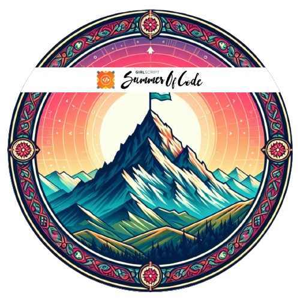

## Hi there 👋, I am Rahul Thakur

I'm a **2nd-year BTech student** majoring in **Mathematics and Computing** at Delhi Technological University. Passionate about Data Science, I enjoy working on real-world projects that leverage **Power BI**, **EDA**, and **data cleaning** techniques to deliver actionable insights. I'm also focused on building a strong foundation in **DSA** and contributing to open-source projects like **GSSoC'24 Extended**. Let's connect and collaborate on exciting tech and data-driven projects!

## 🚀 About Me

- 🌱 Currently enhancing my skills in **Data Science**, **Exploratory Data Analysis**, and **Database Management Systems (DBMS)**.
- 📊 Passionate about **Data Analysis** using tools like **Power BI** and performing **data cleaning**.
- 🤖 Contributing to **GSSoC'24 Extended** and expanding my knowledge in **Data Science**.
- 💼 Open to internships and freelance projects in **Data Science**, and **Software Engineering**.
- 🎯 Actively preparing for **DSA**, honing problem-solving skills.

## 📜 Certifications Badges

